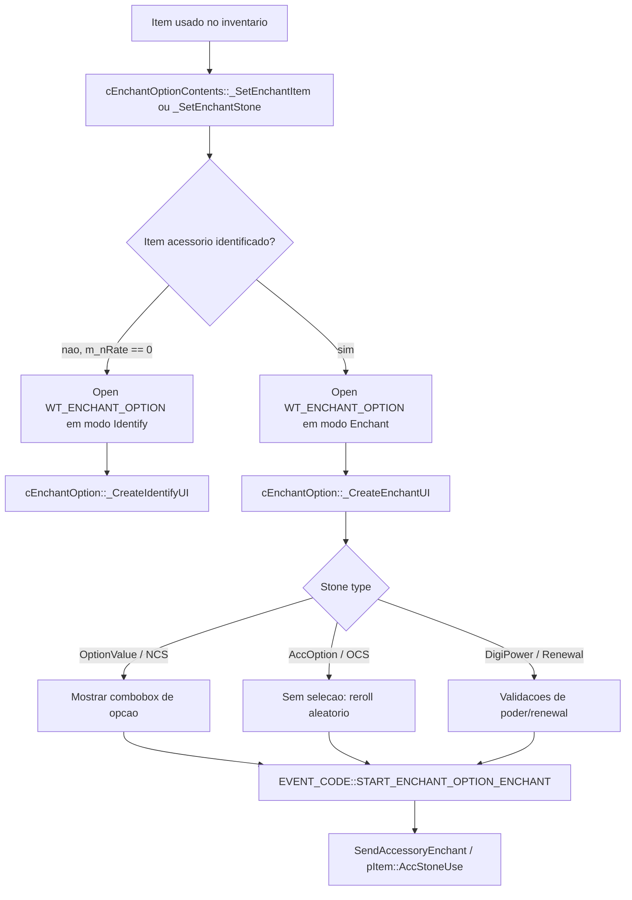

# Function Map - EnchantOption / OCS / NCS

## Janela principal

O sistema ativo no client usa `cEnchantOption` em
`dmo-client-main/DProject/_Interface/Game/EnchantOption.cpp`. A factory fica em
`_BaseWindow.cpp`:

```text
WT_ENCHANT_OPTION -> CreateNewWindow<cEnchantOption>("EnchantOption", ...)
```

O conteudo logico fica em `cEnchantOptionContents`:

```text
E_CT_ENCHANT_OPTION_CONTENTS -> new cEnchantOptionContents()
```

`DataMng.cpp` conecta o adaptador:

```text
m_pEnchantOptionAdapt->SetContents(CONTENTSSYSTEM_PTR->GetContents(E_CT_ENCHANT_OPTION_CONTENTS))
```

## Fluxo de tela



## Funcoes do client ativo

- `cEnchantOption::_CreateIdentifyUI`: monta a tela de identificacao, gauge,
  barra e texto `ACCESSORY_IDENTIFY_IDENTIFYING`.
- `cEnchantOption::_CreateEnchantUI`: monta a janela de encantamento da print,
  slots de acessorio/pedra, botao e close.
- `cEnchantOption::_MakeOptionValueBox`: cria a combobox usada pelo NCS.
- `cEnchantOption::_SetOptionValueBox`: popula a combobox com as opcoes atuais
  do acessorio.
- `cEnchantOption::_AddOptionValueItem`: adiciona cada opcao atual como item
  selecionavel.
- `cEnchantOption::_GetAccOptionValue`: converte `m_nAccOption` e valor em texto
  visivel.
- `cEnchantOptionContents::_CheckEnchantItemType`: aceita Ring, Necklace,
  Earring, Bracelet e, com define, Digivice.
- `cEnchantOptionContents::_RegistEnchantItem`: valida acessorio, option code,
  item ja identificado e bloqueia o item.
- `cEnchantOptionContents::_RegistEnchantStone`: le `GetAccessoryEnchant` pelo
  `s_dwSkill` da pedra e extrai o tipo `s_nOpt`.
- `cEnchantOptionContents::EnchantItem`: executa validacoes por tipo de pedra.
- `cEnchantOptionContents::SuccessIdentifyItem`: envia
  `SendAccessoryCheck(uid, invenIndex)`.
- `cEnchantOptionContents::SuccessEnchantItem`: envia `SendAccessoryEnchant`.

## Decompilado copiado

O decompilado foi promovido de `DigimonAdvanceFeature` para este subprojeto:

- `decompiled/EnchantOptionUI`: factory `0128c5d0`, init `01371e40` e helpers
  compartilhados `01371450..01371fa0`.
- `decompiled/EnchantOptionResultUI`: factory `0128c7f0`, init `01267760` e
  handlers `01267070..01267ef0`.
- `decompiled/DigiPowerEnchantUI`: factory `0128c990`, init `0125dde0` e
  helpers `0125d190..0125ffe0`.
- `decompiled/AdditionalXrefs`: funcoes extras encontradas por busca direta no
  `unpacked_exe_all`:
  - `013729d0`: xref de `ACCESSORY_IDENTIFY_IDENTIFYING`.
  - `01372d20`: xrefs de `ACCESSORY_ENCHANT_ENCHANTMENT` e
    `ACCESSORY_ENCHANT_REGIST_STONE`.
  - `01373ea0`: xrefs de `ACCESSORY_ENCHANT_OPTION` e
    `ACCESSORY_ENCHANT_SAME_OPTION`.
  - `015e9390`: xref de `AccOption.bin`.

`docs/CopiedFunctionFiles.csv` lista todos os arquivos copiados.
